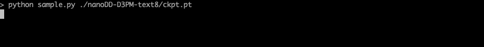
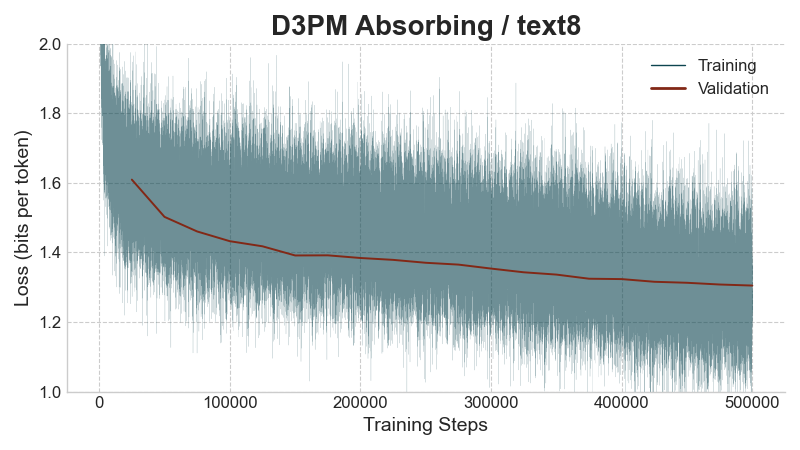

<p align="center">
  
</p>
<p align="center" style="font-family: sans-serif; font-size: 24px;">
  <b>nanoDD</b>
</p>

I'm writing simple & scalable Discrete Diffusion implementations in PyTorch for education, research and fun!

# What is Discrete Diffusion?
In simple terms, typical LLMs (such as GPTs) generate text from left-to-right, while Discrete Diffusion LMs generate a chunk of text in parallel.

More formally, Diffusion is a set of techniques for modeling data by learning a series of conditional *noisy* distributions over *all* token variables. 
This is in contrast to autoregressive models (GPTs etc) that learn *non-noisy* conditional distributions over *one* token variable at a time.
*Discrete* Diffusion is the application of ideas similar to those used by *continuous* diffusion (used for image generation models like Stable Diffusion, Midjourney, Flux etc.) to discrete data, like text. 

Example:



This GIF shows what sampling from a pre-trained masking-based discrete diffusion model looks like using the [sampling script](./sample.py) in this repo.
We start out with the whole sequence composed of mask tokens (maximum "noise") and iteratively unmask --- and hence reduce the noise --- in the sequence.

# Goals for this repo
I want more people to work on discrete diffusion, so the primary goals are to be correct, simple and instructive for newcomers to these algorithms.
Readers should be able to use the implementations to help understand the original papers.

I also want the code to be efficient and scalable so that the repo can be used as a starting point for hacking on ideas.
Similar to the philosophy in [nanoGPT](https://github.com/karpathy/nanoGPT), nanoDD relies on pure PyTorch and avoids abstractions (as well as dependencies that contain abstractions such as training frameworks).
The training script itself is directly adapted from nanoGPT with several modifications.

To start, this repo provides the code to train/evaluate/sample from an [Absorbing (or "Masking") D3PM](https://arxiv.org/abs/2107.03006) using a [Diffusion Transformer](./dit.py) on the [text8](https://paperswithcode.com/dataset/text8) dataset.

Upcoming:
- more models in addition to Absorbing D3PM
- ~~more datasets; text8 is a standard academic benchmark allowing us to compare results to papers, but samples are ugly :(~~ Sampling from an Absorbing D3PM pre-trained on [OpenWebText](https://skylion007.github.io/OpenWebTextCorpus/) is available. Training support coming soon!

# Usage

Install dependencies:
```bash
pip install -r requirements.txt
```

Download pre-trained model and generate samples for text8 dataset:
```bash
# download pre-trained weights for D3PMAbsorbing from HF (~700 MB)
git clone git@hf.co:rupspace/nanoDD-D3PM-text8
# sample 1 text8 sequence (default):
python sample.py ./nanoDD-D3PM-text8/ckpt.pt
# sample 4 sequences in a batch:
python sample.py ./nanoDD-D3PM-text8/ckpt.pt --batch_size 4
# check options for sample.py
python sample.py --help
```

Download pre-trained model and generate samples for openwebtext dataset:
```bash
# download pre-trained weights for D3PMAbsorbing from HF (~1 GB)
git clone git@hf.co:rupspace/nanoDD-D3PM-openwebtext
# sample 1 sequence:
python sample.py ./nanoDD-D3PM-openwebtext/ckpt.pt --dataset openwebtext
```

Or train from scratch:
```bash
# download and prepare text8
python data/prepare_text8.py
# train Absorbing D3PM on text8
python train.py d3pm_text8
# (coming soon) train Absorbing D3PM on openwebtext
```
Note that the training will attempt to compile the model by default, which takes extra time to begin training.
Set `compile=False` in the config or training script to disable this.

Currently, sampling and evaluation scripts do not compile the model, in order to get going immediately.

### Configuration

This is not a full-on research library so the config system is rather simple to avoid using a tool that readers might not know.
However, there is basic support for using different model/configs.

For example, `d3pm_text8()` is a function that defines a configuration in [configs.py](./configs.py) for training D3PMAbsorbing on text8.
One can add new configs by defining functions in this file, and specify their name on the cmd line when running `train.py`.
Any training args defined by a config function over-ride any global training args defined in `train.py`.

### Multi-GPU training
```bash
# d3pm_text8_8gpu modifies the single GPU config (see `configs.py`)
# note that the batch_size config is per GPU, while global_batch_size == batch_size * gradient_accumulation_steps * num_gpus
# validation uses all GPUs, so eval_iters should be modified when changing number of GPUs
torchrun --standalone --nproc_per_node=8 train.py d3pm_text8_8gpu
```

### Evaluating loss
```bash
# evaluate on val set (default)
python evaluate.py ./nanoDD-D3PM-text8/ckpt.pt
# evaluate on test set
python evaluate.py ./nanoDD-D3PM-text8/ckpt.pt --split test
# check options for eval script
python evaluate.py --help
```

# Results

| Model               | Test Bits/Token (text8) |
|---------------------|:-----------------------:|
| D3PM Absorbing      |          1.37           |

Training the D3PM Absorbing model will produce loss values similar to those in the plot below, finally reaching a validation loss of 1.30, which results in a test loss of 1.37.
Note that this is substantially better than in the original paper (1.45).
The training loss will start at around 5.0 (approximated and converted to bits-per-token) and you will observe noisy loss values throughout training due to noise in the diffusion process.

You can sample diffusion time steps more uniformly per batch ("low-discrepancy sampler") and this reduces the variance in the loss but in my experience does not make the training faster or reach a lower mean loss.

